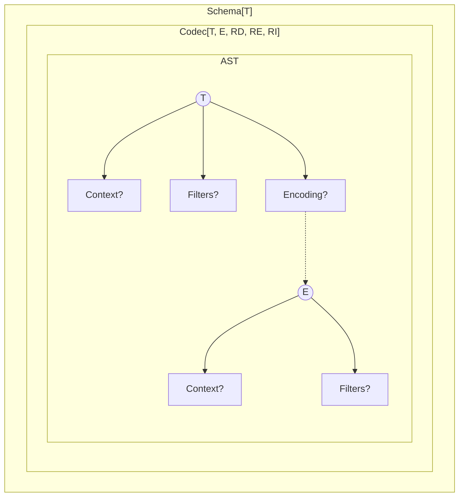
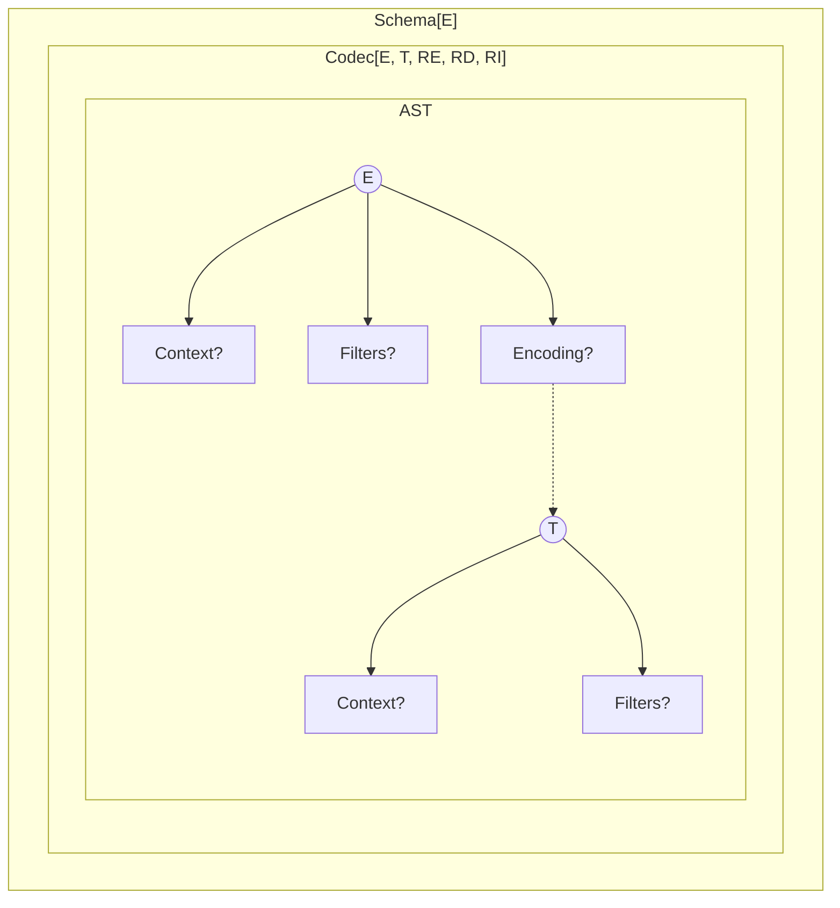
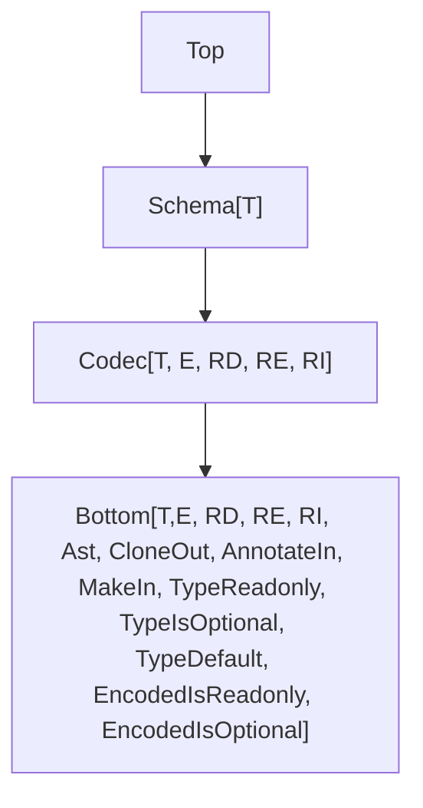

# Planned Changes and Improvements to the `Schema` Module

This document outlines upcoming improvements to the `Schema` module in the Effect library.

## Model



After applying the `Schema.flip` API:



## TODO

- Move all optional `annotations?` into a nested `options` object for better structure.

## Current Pain Points

These are known limitations and difficulties:

- `partial` only allows toggling all fields at once, which limits flexibility.
- Suspended schemas are awkward to use.
- Performance and bundle size need improvement.
- `Schema.Record` does not support key transformations.
- (optional) Custom error handling is limited ([example](https://discord.com/channels/795981131316985866/1347665724361019433/1347831833282347079)).

## Types



## Renamings

- `Schema` to `Codec`
- `asSchema` to `revealCodec`
- `.annotations` will be renamed to `.annotate` (to match usage in other modules)
- `make` will become `makeUnsafe` (to make it clear it throws on error)

## Constructors

### Keeping Constructors in Composed Schemas

To retain constructors in composed schemas, `makeUnsafe` and `make` will be added to the base `Bottom` type.

### Default Values

**Example** (Adding a default value to a field)

```ts
import { Result, Schema } from "effect"

const schema = Schema.Struct({
  a: Schema.NumberFromString.pipe(
    Schema.withConstructorDefault(() => Result.some(-1))
  )
})

console.log(schema.makeUnsafe({}))
// { a: -1 }
```

### Effectful Defaults

Defaults can be effectful as long as their environment (`R`) is `never`.

**Example** (Async default)

```ts
import { Effect, Option, Schema, SchemaParserResult } from "effect"

const schema = Schema.Struct({
  a: Schema.NumberFromString.pipe(
    Schema.withConstructorDefault(() =>
      Effect.gen(function* () {
        yield* Effect.sleep(100)
        return Option.some(-1)
      })
    )
  )
})

SchemaParserResult.asEffect(schema.make({}))
  .pipe(Effect.runPromise)
  .then(console.log)
// { a: -1 }
```

**Example** (Default from optional service)

```ts
import { Context, Effect, Option, Schema, SchemaParserResult } from "effect"

class ConstructorService extends Context.Tag<
  ConstructorService,
  { defaultValue: Effect.Effect<number> }
>()("ConstructorService") {}

const schema = Schema.Struct({
  a: Schema.NumberFromString.pipe(
    Schema.withConstructorDefault(() =>
      Effect.gen(function* () {
        yield* Effect.sleep(100)
        const oservice = yield* Effect.serviceOption(ConstructorService)
        if (Option.isNone(oservice)) {
          return Option.none()
        }
        return Option.some(yield* oservice.value.defaultValue)
      })
    )
  )
})

SchemaParserResult.asEffect(schema.make({}))
  .pipe(
    Effect.provideService(
      ConstructorService,
      ConstructorService.of({ defaultValue: Effect.succeed(-1) })
    ),
    Effect.runPromise
  )
  .then(console.log, console.error)
// { a: -1 }
```

### Nested Default

Default values can be nested, and will be evaluated in order.

**Example** (Nested schema with defaults)

```ts
import { Result, Schema } from "effect"

const schema = Schema.Struct({
  a: Schema.Struct({
    b: Schema.NumberFromString.pipe(
      Schema.withConstructorDefault(() => Result.some(-1))
    )
  }).pipe(Schema.withConstructorDefault(() => Result.some({})))
})

console.log(schema.makeUnsafe({}))
// { a: { b: -1 } }
console.log(schema.makeUnsafe({ a: {} }))
// { a: { b: -1 } }
```

## Filters Redesign

### Return Type Preservation

When using `Schema.filter`, the return type of the original schema is preserved. This means any additional metadata or methods remain available after applying filters.

```ts
import { Schema } from "effect"

//      ┌─── Schema.String
//      ▼
Schema.String

//      ┌─── Schema.String
//      ▼
const NonEmptyString = Schema.String.pipe(Schema.filter(Schema.nonEmpty))

//      ┌─── Schema.String
//      ▼
const schema = NonEmptyString.annotate({})
```

This helps keep functionality such as `.makeUnsafe` or `.fields` intact, even after filters are applied.

```ts
import { Schema } from "effect"

const schema = Schema.Struct({
  name: Schema.String,
  age: Schema.Number
}).pipe(Schema.filter(Schema.predicate(() => true)))

// The fields of the original struct are still accessible
//
//      ┌─── { readonly name: Schema.String; readonly age: Schema.Number; }
//      ▼
const fields = schema.fields
```

### Filters as First-Class

Filters are now standalone values. This allows them to be composed, reused, and applied to any schema that supports the necessary structure.

For example, `minLength` is no longer specific to strings. It can be applied to any schema that defines a `length` property.

**Example** (Validating a trimmed string with minimum length)

```ts
import { Schema, SchemaFormatter, SchemaParser } from "effect"

const schema = Schema.String.pipe(
  Schema.filter(
    Schema.minLength(3), // Filter<string>
    Schema.trimmed // Filter<string>
  )
)

try {
  SchemaParser.decodeUnknownSync(schema)(" a")
} catch (issue: any) {
  console.log(SchemaFormatter.TreeFormatter.format(issue))
}
/*
Output:
string & minLength(3) & trimmed
├─ minLength(3)
│  └─ Invalid value " a"
└─ trimmed
   └─ Invalid value " a"
*/
```

**Example** (Applying `minLength` to a non-string schema)

```ts
import { Schema, SchemaFormatter, SchemaParser } from "effect"

const schema = Schema.Struct({ length: Schema.Number }).pipe(
  Schema.filter(Schema.minLength(3))
)

try {
  SchemaParser.decodeUnknownSync(schema)({ length: 2 })
} catch (issue: any) {
  console.log(SchemaFormatter.TreeFormatter.format(issue))
}
/*
Output:
{ readonly "length": number } & minLength(3)
└─ minLength(3)
   └─ Invalid value {"length":2}
*/
```

By default all filters are run even if one fails. This allows Schema to collect multiple issues at once.

If you want to stop validation as soon as a filter fails, you can call `.stop()` on a filter.

**Example** (Stop at the first failed filter)

```ts
import { Schema, SchemaFormatter, SchemaParser } from "effect"

const schema = Schema.String.pipe(
  Schema.filter(
    Schema.minLength(3).stop(), // Stop on failure here
    Schema.trimmed // This will not run if minLength fails
  )
)

try {
  SchemaParser.decodeUnknownSync(schema)(" a")
} catch (issue: any) {
  console.log(SchemaFormatter.TreeFormatter.format(issue))
}
/*
Output:
string & minLength(3) & trimmed
└─ minLength(3)
   └─ Invalid value " a"
*/
```

### Filter Factories

A **filter factory** is a function that returns a reusable filter. This pattern is useful when you want to create filters that can be customized at runtime.

You can now create filters like `greaterThan` for any type with an ordering.

**Example** (Reusable `greaterThan` filter)

```ts
import { Order } from "effect"

// Creates a filter factory using an Order instance
// Returns a `SchemaAST.Filter<T>`
const makeGreaterThan = <T>(O: Order.Order<T>) => {
  const greaterThan = Order.greaterThan(O)
  return (exclusiveMinimum: T) =>
    Schema.predicate<T>((input) => greaterThan(input, exclusiveMinimum), {
      title: `greaterThan(${exclusiveMinimum})`,
      description: `a value greater than ${exclusiveMinimum}`
    })
}
```

## More Rs

Requirements are now split into three separate types:

- `RD`: for decoding
- `RE`: for encoding
- `RI`: for any intrinsic requirements defined in a custom data type

```ts
interface Codec<T, E, RD, RE, RI> {
  // ...
}
```

This makes it easier to apply requirements only where needed. For instance, encoding requirements can be ignored during decoding:

```ts
import type { Effect } from "effect"
import { Context, Schema, SchemaParser } from "effect"

class EncodingService extends Context.Tag<
  EncodingService,
  {
    encode: Effect.Effect<string>
  }
>()("EncodingService") {}

declare const field: Schema.Codec<string, string, never, EncodingService>

const schema = Schema.Struct({
  a: field
})

//     ┌─── SchemaParser.ParserResult<{ readonly a: string; }, never>
//     ▼
const dec = SchemaParser.decodeUnknownSchemaParserResult(schema)({ a: "a" })

//     ┌─── SchemaParser.ParserResult<{ readonly a: string; }, EncodingService>
//     ▼
const enc = SchemaParser.encodeUnknownSchemaParserResult(schema)({ a: "a" })
```

**Aside** (Why RI Matters)

`RI` allows you to express that a data type needs a service even when it is not strictly about decoding or encoding. This was not possible in v3.

**Example** (Declaring a codec with intrinsic service requirements)

```ts
import { Context, Effect, Schema } from "effect"

// A service used internally by the data type itself
class SomeService extends Context.Tag<
  SomeService,
  {
    someOperation: (u: unknown) => Effect.Effect<string>
  }
>()("SomeService") {}

// The codec requires SomeService to be defined,
// even though the dependency is not passed explicitly
// through the type parameters
//
//     ┌─── declareParserResult<string, number, never, never, SomeService>
//     ▼
const codec = Schema.declareParserResult([])<number>()(
  () => (input) =>
    Effect.gen(function* () {
      const service = yield* SomeService
      return yield* service.someOperation(input)
    })
)
```

## Optional & Mutable Fields

```ts
import { Schema } from "effect"

const schema = Schema.Struct({
  a: Schema.String,
  b: Schema.optionalKey(Schema.String),
  c: Schema.mutableKey(Schema.String),
  d: Schema.optionalKey(Schema.mutableKey(Schema.String))
})

/*
type Type = {
    readonly a: string;
    readonly b?: string;
    c: string;
    d?: string;
}
*/
type Type = (typeof schema)["Type"]
```

## Flipping

Flipping is a transformation that creates a new codec from an existing one by swapping its input and output types.

```ts
import { Schema } from "effect"

// Flips a codec that decodes a string into a number,
// turning it into one that encodes a number into a string
const NumberToString = Schema.flip(Schema.NumberFromString)
```

All internal operations have been made symmetrical. This made it possible to define `Schema.flip`, and also simplified the implementation of the decoding / encoding engine.

```ts
// Encoding with a schema is equivalent to decoding with its flipped version
encode(schema) = decode(flip(schema))
```

## Transformations as First-Class

Transformations are now treated as first-class values, rather than being tied to specific codec combinations as in v3.

For example, `trim` is no longer just a codec combinator. It is now a standalone transformation that can be used with any codec that supports it—in this case, any codec working with strings.

**Example** (Using a transformation with debug logging)

```ts
import { Option, Schema, SchemaParser } from "effect"

// Wrap the trim transformation with debug logging
const trim = Schema.tapTransformation(Schema.trim, {
  onDecode: (o) => {
    if (Option.isSome(o)) {
      console.log(`about to trim "${o.value}"`)
    }
  }
})

// Decode a string, trim it, then parse it into a number
const schema = Schema.String.pipe(Schema.decodeTo(Schema.String, trim))

console.log(SchemaParser.decodeUnknownSync(schema)("  123"))
/*
about to trim "  123"
123
*/
```

## Making Classes First-Class

Classes are currently supported, but not fully integrated.

A potential improvement is to support native constructors directly in the AST (at least for `TypeLiteral`).

```ts
import { Schema } from "effect"

abstract class A extends Schema.Class<A>("A")({
  a: Schema.String
}) {
  abstract foo(): string

  bar() {
    return this.a + "-bar-" + this.foo()
  }
}

class B extends Schema.Class<B>("B")(A) {
  foo() {
    return this.a + "-foo-"
  }
}

const b = new B({ a: "a" })
console.log(b.foo()) // "a-foo-"
console.log(b.bar()) // "a-bar-a-foo-"
```

### Filters

```ts
import { Schema } from "effect"

class A1 extends Schema.Class<A1>("A1")(
  Schema.Struct({
    a: Schema.String
  }).pipe(Schema.filter(({ a }) => a.length > 0))
) {}

// Alternative syntax

class A extends Schema.Class<A>("A")({
  a: Schema.String
}) {}

class A2 extends Schema.Class<A2>("B")(
  A.pipe(Schema.filter(({ a }) => a.length > 0))
) {}
```

## Generics Improvements

Using generics in schema composition and filters can be difficult.

The plan is to make generics **covariant** and easier to use.

**Before (v3)**

```ts
export const minLength = <S extends Schema.Any>(
  minLength: number,
  annotations?: Annotations.Filter<Schema.Type<S>>
) =>
<A extends string>(self: S & Schema<A, Schema.Encoded<S>, Schema.Context<S>>): filter<S>
```

**After (v4)**

```ts
export const minLength = <T extends string>(
  minLength: number,
  annotations?: Annotations<T>
) =>
<S extends Schema<T, any, any>>(self: S): filter<S>
```

## RWC References

- https://github.com/Anastasia-Labs/lucid-evolution/blob/5068114c9f8f95c6b997d0d2233a9e9543632f35/packages/experimental/src/TSchema.ts#L353

## Snippets

### Memoization

```ts
function memoizeIdempotent(f: (ast: AST) => AST): (ast: AST) => AST {
  const cache = new WeakMap<AST, AST>()
  return (ast) => {
    if (cache.has(ast)) {
      return cache.get(ast)!
    }
    const result = f(ast)
    cache.set(ast, result)
    cache.set(result, result)
    return result
  }
}

function memoizeInvolution(f: (ast: AST) => AST): (ast: AST) => AST {
  const cache = new WeakMap<AST, AST>()
  return (ast) => {
    if (cache.has(ast)) {
      return cache.get(ast)!
    }
    const result = f(ast)
    cache.set(ast, result)
    cache.set(result, ast)
    return result
  }
}
```

### Run Filters

```ts
const runFilters = Effect.fnUntraced(function* <A>(
  ast: SchemaAST.AST,
  filters: SchemaAST.Filters | undefined,
  oa: Option.Option<A>,
  options: SchemaAST.ParseOptions
) {
  if (Option.isNone(oa)) {
    return Option.none()
  }
  if (filters) {
    if (Option.isSome(oa)) {
      const a = oa.value

      for (const m of filters) {
        const issues: Array<SchemaAST.Issue> = []
        for (const filter of m.filters) {
          const res = filter.filter(a, options)
          const issue = Effect.isEffect(res) ? yield* res : res
          if (issue) {
            issues.push(new SchemaAST.FilterIssue(filter, issue))
          }
        }
        if (Arr.isNonEmptyArray(issues)) {
          return yield* Effect.fail(
            new SchemaAST.CompositeIssue(ast, oa, issues, Option.some(a))
          )
        }
      }

      oa = Option.some(a)
    }
  }
  return oa
})
```
