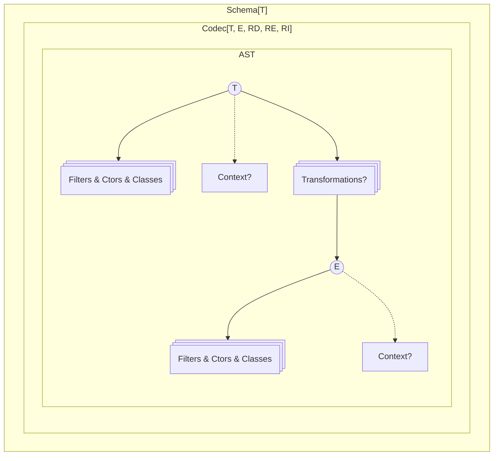
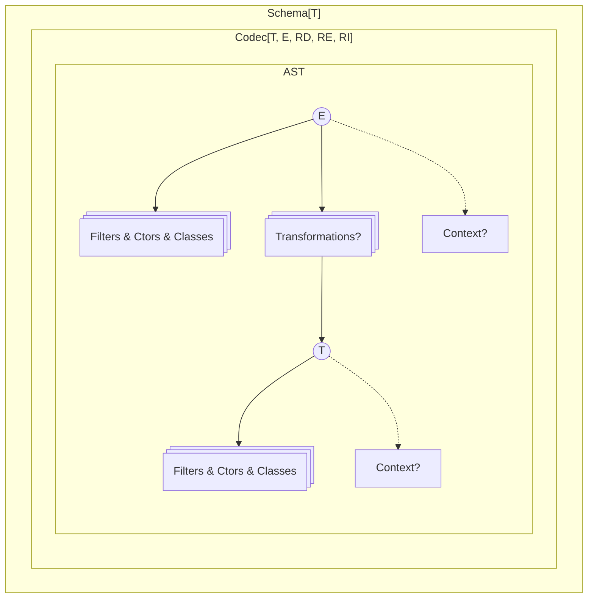
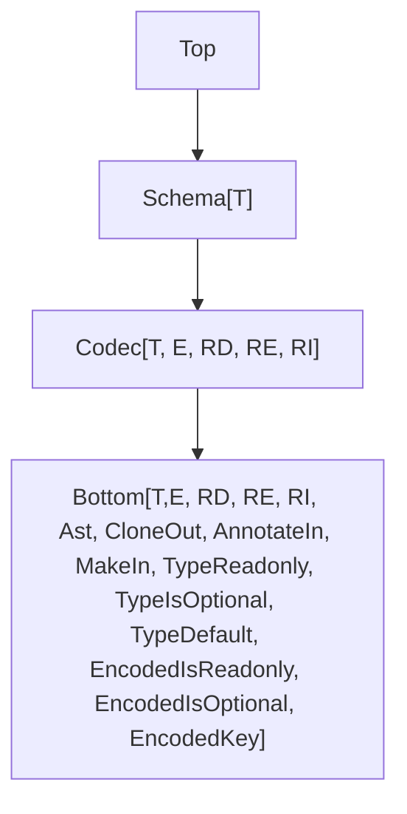

# Planned Changes and Improvements to the `Schema` Module

## Model



After applying the `flip` transformation:



## TODO

- Move all optional `annotations?` into a nested `options` object for better structure.

## Current Pain Points

These are known limitations and difficulties:

- `partial` only allows toggling all fields at once, which limits flexibility.
- Default values that require side effects cannot be defined.
- Suspended schemas are awkward to use.
- Performance and bundle size need improvement.
- `Schema.Record` does not support key transformations.
- (optional) Custom error handling is limited ([example](https://discord.com/channels/795981131316985866/1347665724361019433/1347831833282347079)).

## Types



## Renamings

- `Schema` to `Codec`
- `asSchema` to `revealCodec`
- `.annotations` will be renamed to `.annotate` (to match usage in other modules)
- `make` will become `makeUnsafe` (to make it clear it throws on error)

## Constructor Preservation

When schemas are composed, `makeUnsafe` constructors are lost.

To address this, `makeUnsafe` will be added to the base `Bottom` type, so it stays available in composed schemas.

## Filters Redesign

Although the way filters are defined hasn't changed, the return type is now preserved.

```ts
import { Schema } from "effect"

//      ┌─── Schema.String
//      ▼
Schema.String

//      ┌─── Schema.String
//      ▼
const NonEmptyString = Schema.String.pipe(Schema.filter((s) => s.length > 0))

//      ┌─── Schema.String
//      ▼
const schema = NonEmptyString.annotate({})
```

This helps maintain metadata and methods like `makeUnsafe` or `.fields`.

```ts
import { Schema } from "effect"

const schema = Schema.Struct({
  name: Schema.String,
  age: Schema.Number
}).pipe(Schema.filter(() => true))

// The fields of the original struct are still accessible
//
//      ┌─── { readonly name: Schema.String; readonly age: Schema.Number; }
//      ▼
const fields = schema.fields
```

### Filter Factories

Filter factories allow creating reusable filtering logic.

**Example** (Creating a greater-than filter based on an order)

```ts
const makeGreaterThan = <A>(O: Order.Order<A>) => {
  const f = Order.greaterThan(O)
  return <T extends A>(min: A, annotations?: Annotations<T>) => {
    return <S extends Schema<T, any, any>>(self: S) =>
      self.pipe(
        filter(f(min), {
          title: `greaterThan(${min})`,
          description: `a value greater than ${min}`,
          ...annotations
        })
      )
  }
}
```

## More Rs

Requirements are now split into three separate types:

- `RD`: for decoding
- `RE`: for encoding
- `RI`: for any intrinsic requirements defined in a custom data type

```ts
interface Codec<T, E, RD, RE, RI> {
  // ...
}
```

This makes it easier to apply requirements only where needed. For instance, encoding requirements can be ignored during decoding:

```ts
import type { Effect } from "effect"
import { Context, Schema, SchemaParser } from "effect"

class EncodingService extends Context.Tag<
  EncodingService,
  {
    encode: Effect.Effect<string>
  }
>()("EncodingService") {}

declare const field: Schema.Codec<string, string, never, EncodingService>

const schema = Schema.Struct({
  a: field
})

//     ┌─── SchemaParser.ParserResult<{ readonly a: string; }, never>
//     ▼
const dec = SchemaParser.decodeUnknownParserResult(schema)({ a: "a" })

//     ┌─── SchemaParser.ParserResult<{ readonly a: string; }, EncodingService>
//     ▼
const enc = SchemaParser.encodeUnknownParserResult(schema)({ a: "a" })
```

**Aside** (Why RI Matters)

`RI` allows you to express that a data type needs a service even when it is not strictly about decoding or encoding. This was not possible in v3.

**Example** (Declaring a codec with intrinsic service requirements)

```ts
import { Context, Effect, Schema } from "effect"

// A service used internally by the data type itself
class SomeService extends Context.Tag<
  SomeService,
  {
    someOperation: (u: unknown) => Effect.Effect<string>
  }
>()("SomeService") {}

// The codec requires SomeService to be defined,
// even though the dependency is not passed explicitly
// through the type parameters
//
//     ┌─── declareParserResult<string, number, never, never, SomeService>
//     ▼
const codec = Schema.declareParserResult([])<number>()(
  () => (input) =>
    Effect.gen(function* () {
      const service = yield* SomeService
      return yield* service.someOperation(input)
    })
)
```

## Optional & Mutable Fields

```ts
import { Schema } from "effect"

const schema = Schema.Struct({
  a: Schema.String,
  b: Schema.String.pipe(Schema.optional),
  c: Schema.String.pipe(Schema.mutable),
  d: Schema.String.pipe(Schema.optional, Schema.mutable)
})

/*
type Type = {
    readonly a: string;
    readonly b?: string;
    c: string;
    d?: string;
}
*/
type Type = (typeof schema)["Type"]
```

## Flipping

Flipping is a transformation that creates a new codec from an existing one by swapping its input and output types.

```ts
import { Schema } from "effect"

// Flips a codec that decodes a string into a number,
// turning it into one that encodes a number into a string
const NumberToString = Schema.flip(Schema.NumberFromString)
```

All internal operations have been made symmetrical. This made it possible to define `Schema.flip`, and also simplified the implementation of the decoding / encoding engine.

```ts
// Encoding with a schema is equivalent to decoding with its flipped version
encode(schema) = decode(flip(schema))
```

## Transformation as First-Class

Transformations are now treated as first-class values, rather than being tied to specific codec combinations as in v3.

For example, `trim` is no longer just a codec combinator. It is now a standalone transformation that can be used with any codec that supports it—in this case, any codec working with strings.

**Example** (Using a transformation with debug logging)

```ts
import { Schema, SchemaParser } from "effect"

// Wrap the trim transformation with debug logging
const trim = Schema.tapTransformation(Schema.trim, {
  onDecode: (input) => {
    console.log(`about to trim "${input}"`)
  }
})

// Decode a string, trim it, then parse it into a number
const schema = Schema.String.pipe(
  Schema.decode(trim),
  Schema.decodeTo(Schema.Number, Schema.parseNumber)
)

// Alternatively, apply trim as an encoding transformation
const schema2 = Schema.NumberFromString.pipe(Schema.encode(trim.flip()))

console.log(SchemaParser.decodeUnknownSync(schema)("  123"))
/*
about to trim "  123"
123
*/
```

## Making Classes First-Class

Classes are currently supported, but not fully integrated.

A potential improvement is to support native constructors directly in the AST (at least for `TypeLiteral`).

```ts
import { Schema } from "effect"

abstract class A extends Schema.Class<A>("A")({
  a: Schema.String
}) {
  abstract foo(): string

  bar() {
    return this.a + "-bar-" + this.foo()
  }
}

class B extends Schema.Class<B>("B")(A) {
  foo() {
    return this.a + "-foo-"
  }
}

const b = new B({ a: "a" })
console.log(b.foo()) // "a-foo-"
console.log(b.bar()) // "a-bar-a-foo-"
```

### Filters

```ts
import { Schema } from "effect"

class A1 extends Schema.Class<A1>("A1")(
  Schema.Struct({
    a: Schema.String
  }).pipe(Schema.filter(({ a }) => a.length > 0))
) {}

// Alternative syntax

class A extends Schema.Class<A>("A")({
  a: Schema.String
}) {}

class A2 extends Schema.Class<A2>("B")(
  A.pipe(Schema.filter(({ a }) => a.length > 0))
) {}
```

## Formatter Redesign

Too many formatter variants make usage unclear. These will be unified into a single interface:

```ts
export interface SchemaFormatter<Out> {
  format: (issue: SchemaAST.Issue) => Result.Result<Out> | Effect.Effect<Out>
}
```

**Aside** (Formatting and Services)

- How should the formatter behave if it depends on an external service?

## Generics Improvements

Using generics in schema composition and filters can be difficult.

The plan is to make generics **covariant** and easier to use.

**Before (v3)**

```ts
export const minLength = <S extends Schema.Any>(
  minLength: number,
  annotations?: Annotations.Filter<Schema.Type<S>>
) =>
<A extends string>(self: S & Schema<A, Schema.Encoded<S>, Schema.Context<S>>): filter<S>
```

**After (v4)**

```ts
export const minLength = <T extends string>(
  minLength: number,
  annotations?: Annotations<T>
) =>
<S extends Schema<T, any, any>>(self: S): filter<S>
```

## Breaking Changes

- Annotations are now simple JavaScript objects (`Record<string, unknown>`), no longer keyed by symbols.

## RWC References

- https://github.com/Anastasia-Labs/lucid-evolution/blob/5068114c9f8f95c6b997d0d2233a9e9543632f35/packages/experimental/src/TSchema.ts#L353

## Snippets

### Memoization

```ts
function memoizeIdempotent(f: (ast: AST) => AST): (ast: AST) => AST {
  const cache = new WeakMap<AST, AST>()
  return (ast) => {
    if (cache.has(ast)) {
      return cache.get(ast)!
    }
    const result = f(ast)
    cache.set(ast, result)
    cache.set(result, result)
    return result
  }
}

function memoizeInvolution(f: (ast: AST) => AST): (ast: AST) => AST {
  const cache = new WeakMap<AST, AST>()
  return (ast) => {
    if (cache.has(ast)) {
      return cache.get(ast)!
    }
    const result = f(ast)
    cache.set(ast, result)
    cache.set(result, ast)
    return result
  }
}
```
