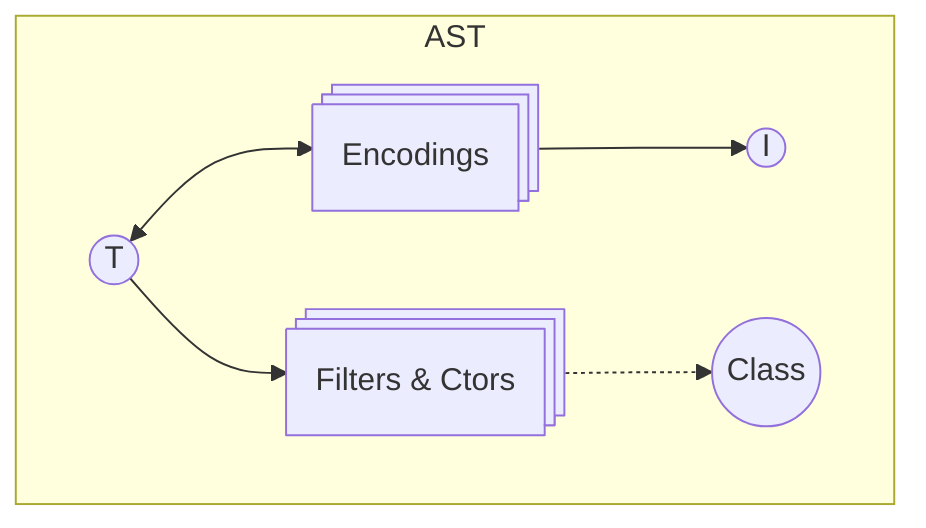
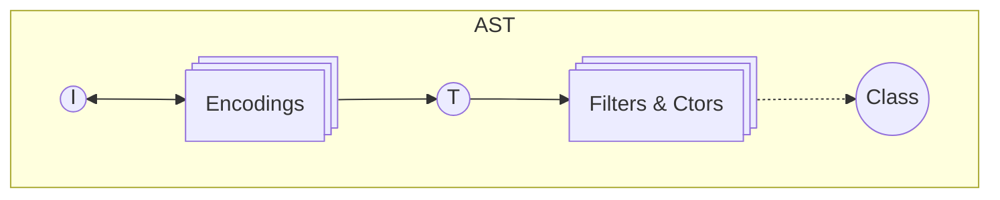

# Planned Changes and Improvements to the `Schema` Module

## Model



After applying the `flip` transformation:



## TODO

- Add `prototype` support to the `Class` API.
- Move all optional `annotations?` into a nested `options` object for better organization and clarity.
- add `isCheckpoint` to refinements?
- memoize `SchemaAST.typeAST`

## Current Pain Points

These are common issues or limitations that users face:

- Mutability handling can be improved.
- `partial` works as an "all-or-nothing" solution, which limits flexibility.
- Defining effectful defaults is not possible.
- Suspended schemas are difficult to work with.
- Performance and bundle size could be optimized.
- Key transformations are not currently supported in `Schema.Record`.
- There's no `flip` API.
- (optional) better custom error handling: example https://discord.com/channels/795981131316985866/1347665724361019433/1347831833282347079

## Making Classes First-Class

### Problem

Class-based schemas should be treated as first-class features, but currently lack full support.

### Solution

Allow native constructor handling directly in the AST (limited to `TypeLiteral`).

### Example

**Subclassing a schema and using instance methods**

```ts
import { Schema } from "effect"

abstract class A extends Schema.Class<A>("A")(
  Schema.Struct({
    a: Schema.String
  })
) {
  abstract foo(): string

  bar() {
    return this.a + "-bar-" + this.foo()
  }
}

class B extends Schema.Class<B>("B")(A) {
  foo() {
    return this.a + "-foo-"
  }
}

const b = new B({ a: "a" })
console.log(b.foo()) // "a-foo-"
console.log(b.bar()) // "a-bar-a-foo-"
```

### To Consider

- Should `Fields` be accepted directly as a parameter?

## Issue Simplification

### Problem

Working with `Issue` is overly complex—users sometimes have to pass `ast` even when unnecessary.

### Solution

Simplify the `Issue` type and remove `ast` from APIs like `filter`.

## Formatter Redesign

### Problem

Too many formatter variations lead to confusion.

### Solution

Unify into a single formatter operation.

### To Consider

- What if formatting relies on a service?

### Proposed API

```ts
export interface SchemaFormatter<Out> {
  format: (issue: SchemaAST.Issue) => Result.Result<Out> | Effect.Effect<Out>
}
```

## Filter Redesign

### Problem

There are too many filter variations, each doing essentially the same thing.

### Solution

Introduce filter **factories** for reusable filter patterns.

### Example

**Creating a greater-than filter based on an order**

```ts
const makeGreaterThan = <A>(O: Order.Order<A>) => {
  const f = Order.greaterThan(O)
  return <T extends A>(min: A, annotations?: Annotations<T>) => {
    return <S extends Schema<T, any, any>>(self: S) =>
      self.pipe(
        filter(f(min), {
          title: `greaterThan(${min})`,
          description: `a value greater than ${min}`,
          ...annotations
        })
      )
  }
}
```

## Constructor Preservation

### Problem

`make` constructors are lost when composing schemas.

### Solution

Add `make` to the base `Schema` type and ensure it is preserved in derived types.

## Generics Improvements

### Problem

Working with generics in filters and schema composition is too difficult.

### Solution

Make all generics **covariant**, and simplify their usage.

### Comparison

**v3**

```ts
export const minLength = <S extends Schema.Any>(
  minLength: number,
  annotations?: Annotations.Filter<Schema.Type<S>>
) =>
<A extends string>(self: S & Schema<A, Schema.Encoded<S>, Schema.Context<S>>): filter<S>
```

**v4**

```ts
export const minLength = <T extends string>(
  minLength: number,
  annotations?: Annotations<T>
) =>
<S extends Schema<T, any, any>>(self: S): filter<S>
```

## Breaking Changes

- Annotations are now plain objects: `Record<string, unknown>`, instead of using symbols.

## RWC Reference

- https://github.com/Anastasia-Labs/lucid-evolution/blob/5068114c9f8f95c6b997d0d2233a9e9543632f35/packages/experimental/src/TSchema.ts#L353

## Fantasy Land Syntax

**Example** (Struct)

```ts
import { Schema } from "effect"

const schema = Schema.Struct({
  a: Schema.String,
  "b?": Schema.String, // optional field
  "mutable c": Schema.String // mutable field
})
```
