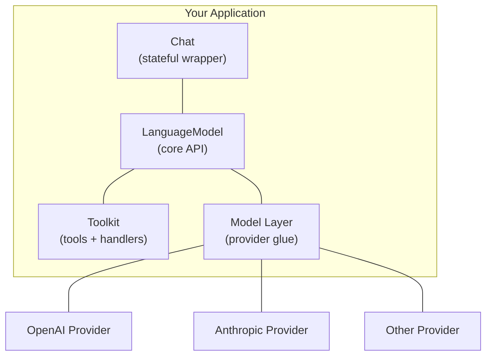

# Building AI Agents with Effect

A beginner course on developing coding AI agents using the `effect/unstable/ai` modules.

## 1. Introduction

The `effect/unstable/ai` modules provide a **provider-agnostic**, **type-safe** framework for building AI agents. Instead of coupling your code to OpenAI or Anthropic directly, you program against abstract services (`LanguageModel`, `Chat`, `Tool`, `Toolkit`) and swap providers via layers.

### What you'll learn

- Generate text and structured objects from LLMs
- Stream responses in real-time
- Define tools that LLMs can call
- Build agentic loops where the model reasons and acts autonomously
- Handle errors with semantic, provider-agnostic error types
- Compose multiple providers with fallback strategies

### Prerequisites

- Basic TypeScript knowledge
- Familiarity with Effect's core concepts (`Effect`, `Layer`, `Schema`, `ServiceMap`)
- An API key from OpenAI or Anthropic

### Key Imports

All AI modules live under `effect/unstable/ai`:

```ts
import { AiError, Chat, LanguageModel, Model, Prompt, Tool, Toolkit } from "effect/unstable/ai"
```

Provider-specific packages (e.g. `@effect/ai-openai`, `@effect/ai-anthropic`) supply the concrete implementations.

---

## 2. Core Concepts

### Architecture Overview



**LanguageModel** is the core service — it has three operations:

- `generateText` — non-streaming text generation
- `generateObject` — schema-validated structured output
- `streamText` — streaming text generation

**Chat** wraps LanguageModel with automatic conversation history management.

**Tool / Toolkit** let you define capabilities (search, API calls, code execution) that the model can invoke during generation.

**Model** provides the glue between your abstract code and a specific provider + model name.

---

## 3. Lesson 1: Text Generation with LanguageModel

### Setting Up a Provider

First, configure a provider client. Here's OpenAI:

```ts
import { OpenAiClient } from "@effect/ai-openai"
import { Config, Layer } from "effect"
import { FetchHttpClient } from "effect/unstable/http"

// Create the client layer using Config for the API key
const OpenAiClientLayer = OpenAiClient.layerConfig({
  apiKey: Config.redacted("OPENAI_API_KEY")
}).pipe(
  Layer.provide(FetchHttpClient.layer)
)
```

### Basic Text Generation

The simplest way to generate text — use the static `LanguageModel.generateText` function:

```ts
const program = Effect.gen(function*() {
  const response = yield* LanguageModel.generateText({
    prompt: "Explain what a monad is in one sentence."
  })

  console.log(response.text)
  console.log(`Tokens used: ${response.usage.outputTokens.total}`)
  console.log(`Finish reason: ${response.finishReason}`)
})
```

### Providing the Model

The program above requires a `LanguageModel` in its environment. Supply it with a provider:

```ts
const modelLayer = OpenAiLanguageModel.model("gpt-4.1")

const runnable = program.pipe(
  Effect.provide(modelLayer),
  Effect.provide(OpenAiClientLayer)
)
```

### Key Response Fields

| Field                   | Type               | Description                                                         |
| ----------------------- | ------------------ | ------------------------------------------------------------------- |
| `response.text`         | `string`           | Concatenated text content                                           |
| `response.finishReason` | `FinishReason`     | Why generation stopped (`"stop"`, `"length"`, `"tool-calls"`, etc.) |
| `response.usage`        | `Usage`            | Token counts (input/output)                                         |
| `response.parts`        | `Part[]`           | Raw response parts (text, tool calls, reasoning, etc.)              |
| `response.toolCalls`    | `ToolCallPart[]`   | Tool invocations made by the model                                  |
| `response.toolResults`  | `ToolResultPart[]` | Results from executed tool handlers                                 |

---

## 4. Lesson 2: Structured Output

Use `generateObject` to get schema-validated responses. The model output is automatically decoded through a `Schema`.

```ts
import { Schema } from "effect"
import { LanguageModel } from "effect/unstable/ai"

// Define the output schema
class CodeReview extends Schema.Class<CodeReview>("CodeReview")({
  score: Schema.Number.annotate({ description: "Quality score from 1 to 10" }),
  issues: Schema.Array(Schema.Struct({
    severity: Schema.Literal("low", "medium", "high"),
    description: Schema.String
  })),
  suggestion: Schema.String
}) {}

const reviewCode = Effect.fn("reviewCode")(function*(code: string) {
  const model = yield* LanguageModel.LanguageModel
  const response = yield* model.generateObject({
    objectName: "code_review",
    prompt: `Review this code and provide structured feedback:\n\n${code}`,
    schema: CodeReview
  })

  // response.value is fully typed as CodeReview
  const review = response.value
  console.log(`Score: ${review.score}/10`)
  for (const issue of review.issues) {
    console.log(`[${issue.severity}] ${issue.description}`)
  }
})
```

### Tips for Structured Output

- **Annotate fields** with `description` — helps the model understand what each field expects
- **Use Schema.Literal** for enums — constrains the model to valid values
- **Use Schema.withDecodingDefault** for optional fields with defaults

---

## 5. Lesson 3: Streaming Responses

For real-time output, use `streamText`. It returns a `Stream` of response parts.

```ts
import { Effect, Stream } from "effect"
import { LanguageModel, type Response } from "effect/unstable/ai"

const streamExample = Effect.gen(function*() {
  const stream = LanguageModel.streamText({
    prompt: "Write a haiku about functional programming."
  })

  // Filter for text deltas and print them as they arrive
  yield* stream.pipe(
    Stream.filter((part): part is Response.TextDeltaPart => part.type === "text-delta"),
    Stream.map((part) => part.delta),
    Stream.runForEach((text) => Effect.sync(() => process.stdout.write(text)))
  )
})
```

### Stream Part Types

| Part Type         | Description                          |
| ----------------- | ------------------------------------ |
| `text-start`      | Text generation begins               |
| `text-delta`      | Incremental text chunk               |
| `text-end`        | Text generation ends                 |
| `tool-call-start` | Tool call begins                     |
| `tool-call-delta` | Incremental tool call argument       |
| `tool-call-end`   | Tool call complete                   |
| `tool-result`     | Tool handler result                  |
| `finish`          | Generation complete (includes usage) |

---

## 6. Lesson 4: Defining Tools

Tools let the model perform actions. Each tool has a name, description, parameter schema, and success schema.

```ts
import { Schema } from "effect"
import { Tool } from "effect/unstable/ai"

// A tool that searches a codebase
const SearchCode = Tool.make("SearchCode", {
  description: "Search the codebase for files matching a query",
  parameters: Schema.Struct({
    query: Schema.String.annotate({
      description: "Search query (regex supported)"
    }),
    filePattern: Schema.String.pipe(
      Schema.withDecodingDefault(() => "**/*")
    ).annotate({
      description: "Glob pattern to filter files"
    })
  }),
  success: Schema.Array(Schema.Struct({
    file: Schema.String,
    line: Schema.Number,
    content: Schema.String
  }))
})

// A tool that runs a shell command
const RunCommand = Tool.make("RunCommand", {
  description: "Execute a shell command and return its output",
  parameters: Schema.Struct({
    command: Schema.String.annotate({
      description: "The shell command to execute"
    }),
    timeout: Schema.Number.pipe(
      Schema.withDecodingDefault(() => 30000)
    ).annotate({
      description: "Timeout in milliseconds"
    })
  }),
  success: Schema.Struct({
    exitCode: Schema.Number,
    stdout: Schema.String,
    stderr: Schema.String
  }),
  // Return errors to the model instead of failing the effect.
  // This lets the model retry or adjust its approach.
  failureMode: "return"
})
```

### `failureMode` Explained

- `"error"` (default) — handler errors propagate to the caller's error channel
- `"return"` — handler errors are sent back to the model as tool results, allowing it to self-correct

For coding agents, `"return"` is often preferred — if a command fails, the model sees the error and can try a different approach.

---

## 7. Lesson 5: Toolkits and Handlers

Group tools into a `Toolkit`, then implement handlers.

### Creating a Toolkit

```ts
import { Effect, Layer, Schema } from "effect"
import { Tool, Toolkit } from "effect/unstable/ai"

const SearchCode = Tool.make("SearchCode", {
  description: "Search code by regex",
  parameters: Schema.Struct({
    query: Schema.String
  }),
  success: Schema.Array(Schema.String)
})

const ReadFile = Tool.make("ReadFile", {
  description: "Read a file's contents",
  parameters: Schema.Struct({
    path: Schema.String
  }),
  success: Schema.String
})

const WriteFile = Tool.make("WriteFile", {
  description: "Write content to a file",
  parameters: Schema.Struct({
    path: Schema.String,
    content: Schema.String
  }),
  success: Schema.Struct({ written: Schema.Boolean })
})

// Bundle into a toolkit
const CodingToolkit = Toolkit.make(SearchCode, ReadFile, WriteFile)
```

### Implementing Handlers

```ts
import * as fs from "node:fs"

// toLayer returns a Layer that satisfies the toolkit's handler requirements.
// The effect passed to toLayer can access other services for initialization.
const CodingToolkitLayer = CodingToolkit.toLayer(Effect.gen(function*() {
  // You could yield* other services here, e.g. a database or file system client

  return CodingToolkit.of({
    SearchCode: Effect.fn("CodingToolkit.SearchCode")(function*({ query }) {
      // Real implementation would use grep/ripgrep
      return [`src/index.ts:10: matches "${query}"`]
    }),
    ReadFile: Effect.fn("CodingToolkit.ReadFile")(function*({ path }) {
      return fs.readFileSync(path, "utf-8")
    }),
    WriteFile: Effect.fn("CodingToolkit.WriteFile")(function*({ path, content }) {
      fs.writeFileSync(path, content)
      return { written: true }
    })
  })
}))
```

### Using the Toolkit with LanguageModel

```ts
const program = Effect.gen(function*() {
  const toolkit = yield* CodingToolkit

  const response = yield* LanguageModel.generateText({
    prompt: "Find all TODO comments in the codebase",
    toolkit,
    toolChoice: "auto" // "auto" | "required" | "none" | { tool: "ToolName" }
  })

  console.log(response.text)
  console.log(`Tools called: ${response.toolCalls.length}`)
})
```

---

## 8. Lesson 6: Stateful Chat Sessions

`Chat` maintains conversation history automatically, so each turn has full context.

### Creating a Chat Session

```ts
import { Effect, Ref } from "effect"
import { Chat, Prompt } from "effect/unstable/ai"

const program = Effect.gen(function*() {
  // Create with an optional system prompt
  const chat = yield* Chat.fromPrompt(
    Prompt.empty.pipe(
      Prompt.setSystem("You are a helpful coding assistant.")
    )
  )

  // First turn
  const r1 = yield* chat.generateText({
    prompt: "What does the `map` function do in functional programming?"
  })
  console.log(r1.text)

  // Second turn — the model sees the full conversation
  const r2 = yield* chat.generateText({
    prompt: "Show me an example in TypeScript."
  })
  console.log(r2.text)

  // Inspect history at any point
  const history = yield* Ref.get(chat.history)
  console.log(`Messages in history: ${history.content.length}`)
})
```

### Exporting and Restoring Chat

```ts
const program = Effect.gen(function*() {
  const chat = yield* Chat.empty

  yield* chat.generateText({ prompt: "Hello!" })

  // Export to JSON for persistence
  const json = yield* chat.exportJson

  // Later, restore from JSON
  const restored = yield* Chat.fromJson(json)
  const response = yield* restored.generateText({
    prompt: "What did I just say?"
  })
})
```

---

## 9. Lesson 7: Building an Agentic Loop

This is where it gets powerful. An agentic loop lets the model reason, call tools, observe results, and repeat until it has a final answer.

### The Pattern

```ts
import { Effect, Schema } from "effect"
import { Chat, Prompt, Tool, Toolkit } from "effect/unstable/ai"

// Define the agent's tools
const SearchCode = Tool.make("SearchCode", {
  description: "Search code for a pattern",
  parameters: Schema.Struct({ query: Schema.String }),
  success: Schema.Array(Schema.Struct({
    file: Schema.String,
    line: Schema.Number,
    match: Schema.String
  })),
  failureMode: "return"
})

const ReadFile = Tool.make("ReadFile", {
  description: "Read a file",
  parameters: Schema.Struct({ path: Schema.String }),
  success: Schema.String,
  failureMode: "return"
})

const EditFile = Tool.make("EditFile", {
  description: "Replace text in a file",
  parameters: Schema.Struct({
    path: Schema.String,
    oldText: Schema.String,
    newText: Schema.String
  }),
  success: Schema.Struct({ success: Schema.Boolean }),
  failureMode: "return"
})

const AgentToolkit = Toolkit.make(SearchCode, ReadFile, EditFile)

// The agentic loop
const runAgent = Effect.fn("runAgent")(function*(task: string) {
  const tools = yield* AgentToolkit

  const session = yield* Chat.fromPrompt([
    {
      role: "system",
      content: "You are a coding agent. Use the provided tools to complete tasks. " +
        "Search for relevant code, read files to understand context, and make edits. " +
        "When you are done, respond with a summary of changes made."
    },
    { role: "user", content: task }
  ])

  // The loop: generate, check for tool calls, repeat
  while (true) {
    const response = yield* session.generateText({
      prompt: [],
      toolkit: tools
    })

    // If the model called tools, continue the loop.
    // Chat automatically adds tool results to the history.
    if (response.toolCalls.length > 0) {
      continue
    }

    // No tool calls = the model is done
    return response.text
  }
})
```

### How It Works

1. The model receives the task and available tools
2. It decides which tool to call (e.g., `SearchCode`)
3. The framework decodes parameters, runs the handler, encodes the result
4. The result is added to the conversation history
5. The model sees the result and decides its next action
6. Repeat until the model responds with text only (no tool calls)

### Adding Safety Limits

```ts
const runAgentSafe = Effect.fn("runAgentSafe")(function*(task: string) {
  const tools = yield* AgentToolkit
  const session = yield* Chat.fromPrompt([
    { role: "system", content: "You are a coding agent." },
    { role: "user", content: task }
  ])

  const maxIterations = 20
  let iterations = 0

  while (iterations < maxIterations) {
    iterations++
    const response = yield* session.generateText({
      prompt: [],
      toolkit: tools
    })

    if (response.toolCalls.length === 0) {
      return response.text
    }

    yield* Effect.logInfo(
      `Iteration ${iterations}: called ${response.toolCalls.map((c) => c.name).join(", ")}`
    )
  }

  return "Agent reached maximum iterations without completing."
})
```

---

## 10. Lesson 8: Multi-Provider Strategies

Use `ExecutionPlan` to try multiple providers with fallback.

```ts
import { AnthropicLanguageModel } from "@effect/ai-anthropic"
import { OpenAiLanguageModel } from "@effect/ai-openai"
import { Effect, ExecutionPlan } from "effect"
import { LanguageModel } from "effect/unstable/ai"

// Try a cheap model first, fall back to a more capable one
const SmartFallback = ExecutionPlan.make(
  {
    provide: OpenAiLanguageModel.model("gpt-4.1-mini"),
    attempts: 2
  },
  {
    provide: AnthropicLanguageModel.model("claude-sonnet-4-6"),
    attempts: 2
  },
  {
    provide: AnthropicLanguageModel.model("claude-opus-4-6"),
    attempts: 1
  }
)

const program = Effect.gen(function*() {
  const plan = yield* SmartFallback.withRequirements

  const response = yield* LanguageModel.generateText({
    prompt: "Solve this complex coding problem..."
  }).pipe(
    Effect.withExecutionPlan(plan)
  )

  return response.text
})
```

Each entry in the plan is tried in order. If all `attempts` for a provider fail, the next provider is tried.

---

## 11. Lesson 9: Error Handling

All AI errors are represented as `AiError` with a semantic `reason` field.

### Error Categories

| Category    | Examples                                                                             |
| ----------- | ------------------------------------------------------------------------------------ |
| **Service** | `RateLimitError`, `QuotaExhaustedError`, `AuthenticationError`, `ContentPolicyError` |
| **Request** | `InvalidRequestError`, `NetworkError`, `InternalProviderError`                       |
| **Output**  | `InvalidOutputError`, `StructuredOutputError`, `UnsupportedSchemaError`              |
| **Tool**    | `ToolNotFoundError`, `ToolParameterValidationError`, `InvalidToolResultError`        |

### Custom Domain Errors

Wrap `AiError` in your own error type for clean domain boundaries:

```ts
import { Schema } from "effect"
import { AiError } from "effect/unstable/ai"

class AgentError extends Schema.TaggedErrorClass<AgentError>()("AgentError", {
  reason: AiError.AiErrorReason
}) {
  static fromAiError(error: AiError.AiError) {
    return new AgentError({ reason: error.reason })
  }
}

// Use in your service
const myAgent = Effect.fn("myAgent")(
  function*(task: string) {
    // ... agent logic
  },
  Effect.mapError((error) => AgentError.fromAiError(error))
)
```

### Retryability

Each error reason has an `isRetryable` property and optional `retryAfter` duration:

```ts
import { Effect } from "effect"
import { AiError } from "effect/unstable/ai"

const withRetry = <A, R>(effect: Effect.Effect<A, AiError.AiError, R>) =>
  effect.pipe(
    Effect.retry({
      while: (error) => error.reason.isRetryable,
      times: 3
    })
  )
```

---

## 12. Lesson 10: Putting It All Together

Here's a complete coding agent service that searches code, reads files, and makes edits.

```ts
import { OpenAiClient, OpenAiLanguageModel } from "@effect/ai-openai"
import { Config, Effect, Layer, Schema, ServiceMap } from "effect"
import { AiError, Chat, LanguageModel, Tool, Toolkit } from "effect/unstable/ai"
import { FetchHttpClient } from "effect/unstable/http"

// ---------------------------------------------------------------------------
// Error type
// ---------------------------------------------------------------------------

class CodingAgentError extends Schema.TaggedErrorClass<CodingAgentError>()(
  "CodingAgentError",
  { reason: AiError.AiErrorReason }
) {
  static fromAiError(error: AiError.AiError) {
    return new CodingAgentError({ reason: error.reason })
  }
}

// ---------------------------------------------------------------------------
// Tools
// ---------------------------------------------------------------------------

const SearchCode = Tool.make("SearchCode", {
  description: "Search the codebase using a regex pattern",
  parameters: Schema.Struct({
    pattern: Schema.String.annotate({ description: "Regex pattern to search for" }),
    fileGlob: Schema.String.pipe(
      Schema.withDecodingDefault(() => "**/*.ts")
    ).annotate({ description: "Glob pattern for files to search" })
  }),
  success: Schema.Array(Schema.Struct({
    file: Schema.String,
    line: Schema.Number,
    text: Schema.String
  })),
  failureMode: "return"
})

const ReadFile = Tool.make("ReadFile", {
  description: "Read a file from disk",
  parameters: Schema.Struct({
    path: Schema.String.annotate({ description: "File path to read" })
  }),
  success: Schema.String,
  failureMode: "return"
})

const WriteFile = Tool.make("WriteFile", {
  description: "Write content to a file (creates or overwrites)",
  parameters: Schema.Struct({
    path: Schema.String.annotate({ description: "File path to write" }),
    content: Schema.String.annotate({ description: "Content to write" })
  }),
  success: Schema.Struct({ ok: Schema.Boolean }),
  failureMode: "return"
})

const RunTests = Tool.make("RunTests", {
  description: "Run the test suite and return results",
  parameters: Schema.Struct({
    testFile: Schema.String.pipe(
      Schema.withDecodingDefault(() => "")
    ).annotate({ description: "Specific test file to run, or empty for all" })
  }),
  success: Schema.Struct({
    passed: Schema.Number,
    failed: Schema.Number,
    output: Schema.String
  }),
  failureMode: "return"
})

const AgentTools = Toolkit.make(SearchCode, ReadFile, WriteFile, RunTests)

// ---------------------------------------------------------------------------
// Tool handlers (your real implementations go here)
// ---------------------------------------------------------------------------

const AgentToolsLayer = AgentTools.toLayer(Effect.gen(function*() {
  return AgentTools.of({
    SearchCode: Effect.fn("AgentTools.SearchCode")(function*({ pattern, fileGlob }) {
      // Replace with real grep/ripgrep integration
      return [{ file: "src/index.ts", line: 42, text: `match: ${pattern}` }]
    }),
    ReadFile: Effect.fn("AgentTools.ReadFile")(function*({ path }) {
      // Replace with real file read
      return `// contents of ${path}`
    }),
    WriteFile: Effect.fn("AgentTools.WriteFile")(function*({ path, content }) {
      // Replace with real file write
      return { ok: true }
    }),
    RunTests: Effect.fn("AgentTools.RunTests")(function*({ testFile }) {
      // Replace with real test runner
      return { passed: 5, failed: 0, output: "All tests passed" }
    })
  })
}))

// ---------------------------------------------------------------------------
// Agent Service
// ---------------------------------------------------------------------------

class CodingAgent extends ServiceMap.Service<CodingAgent, {
  solve(task: string): Effect.Effect<string, CodingAgentError>
}>()("app/CodingAgent") {
  static readonly layer = Layer.effect(
    CodingAgent,
    Effect.gen(function*() {
      const tools = yield* AgentTools
      const modelLayer = yield* OpenAiLanguageModel.model("gpt-4.1")

      const solve = Effect.fn("CodingAgent.solve")(
        function*(task: string) {
          const session = yield* Chat.fromPrompt([
            {
              role: "system",
              content: [
                "You are a coding agent. You can search code, read files, write files, and run tests.",
                "Follow this workflow:",
                "1. Search for relevant code",
                "2. Read the files to understand context",
                "3. Make the necessary changes",
                "4. Run tests to verify",
                "5. If tests fail, fix and retry",
                "When done, respond with a summary of changes."
              ].join("\n")
            },
            { role: "user", content: task }
          ])

          let iterations = 0
          const maxIterations = 25

          while (iterations < maxIterations) {
            iterations++
            const response = yield* session.generateText({
              prompt: [],
              toolkit: tools
            }).pipe(Effect.provide(modelLayer))

            if (response.toolCalls.length === 0) {
              return response.text
            }

            yield* Effect.logInfo(
              `[${iterations}] ${response.toolCalls.map((c) => c.name).join(", ")}`
            )
          }

          return "Reached iteration limit."
        },
        Effect.catchTag(
          "AiError",
          (error) => Effect.fail(CodingAgentError.fromAiError(error)),
          (e) => Effect.die(e)
        )
      )

      return CodingAgent.of({ solve })
    })
  ).pipe(
    Layer.provide(AgentToolsLayer),
    Layer.provide(
      OpenAiClient.layerConfig({
        apiKey: Config.redacted("OPENAI_API_KEY")
      }).pipe(Layer.provide(FetchHttpClient.layer))
    )
  )
}

// ---------------------------------------------------------------------------
// Run it
// ---------------------------------------------------------------------------

const main = Effect.gen(function*() {
  const agent = yield* CodingAgent
  const result = yield* agent.solve(
    "Add input validation to the createUser function in src/users.ts"
  )
  console.log(result)
}).pipe(Effect.provide(CodingAgent.layer))

// Effect.runPromise(main)
```

---

## Recap

| Concept            | Module             | Key Function                     |
| ------------------ | ------------------ | -------------------------------- |
| Text generation    | `LanguageModel`    | `generateText`, `streamText`     |
| Structured output  | `LanguageModel`    | `generateObject`                 |
| Tool definition    | `Tool`             | `Tool.make`                      |
| Tool grouping      | `Toolkit`          | `Toolkit.make`, `.toLayer()`     |
| Conversation state | `Chat`             | `Chat.empty`, `Chat.fromPrompt`  |
| Agentic loop       | `Chat` + `Toolkit` | `while` loop with `generateText` |
| Multi-provider     | `ExecutionPlan`    | `ExecutionPlan.make`             |
| Error handling     | `AiError`          | `AiErrorReason`, `isRetryable`   |

### Next Steps

- Add `needsApproval` to sensitive tools so the agent asks for confirmation before executing
- Use `Chat.Persisted` for durable agent sessions that survive restarts
- Integrate `EmbeddingModel` for RAG (retrieval-augmented generation)
- Add `Tokenizer` to manage context window limits
- Build an MCP server with `McpServer` to expose your tools to other AI clients
